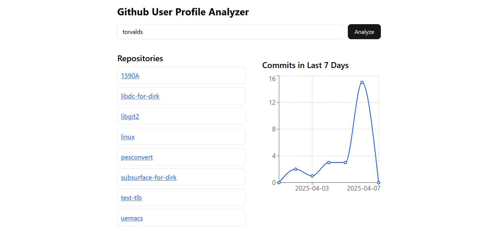

# GitHub User Profile Analyzer

A React + TypeScript application to analyze any GitHub user's profile.

This application shows:
* Public Repositories of the user.
* Commits Activity (Daily Commits Chart for the last 7 days).

Built using:
* React
* TypeScript
* ShadCN UI components
* Tailwind CSS

## Demo

Enter any GitHub username to see their public repositories and commits chart.

## Features

* Fetch Public Repositories from GitHub API.
* Fetch Commits Data from GitHub API.
* Responsive UI using Tailwind CSS.
* ShadCN Components for modern UI.
* Commits Chart to visualize daily commits.
* Mobile-friendly layout.
* Desktop view → Repositories & Commits Chart shown side-by-side.

## Tech Stack

| Tech | Usage |
|------|-------|
| React | Frontend |
| TypeScript | Type Safety |
| ShadCN UI | UI Components |
| Tailwind CSS | Styling |
| GitHub REST API | Fetching Data |

## Instructions to Run Locally

### 1. Clone the Repository

```bash
git clone https://github.com/bindalsourabh1/github-profile-project
cd github-profile-project
```

OR Download the ZIP and Extract.

### 2. Install Dependencies

```bash
npm install
```

### 3. Start the Development Server

```bash
npm run dev
```

### 4. Open in Browser
Visit → `http://localhost:5173`

## Production Build

```bash
npm run build
```

To preview the production build:

```bash
npm run preview
```

## Deployment

You can deploy this app easily on:
* Vercel (Recommended)

1. Install the Vercel CLI:
   ```bash
   npm install -g vercel
   ```

2. Deploy:
   ```bash
   vercel
   ```

## Note on GitHub API Limitations

* The GitHub REST API has a rate limit for unauthenticated users.
* If you see an error like:
```
API rate limit exceeded
```
→ This happens because you are making too many requests without authentication.

## Folder Structure

```
src/
│
├── components/
│   ├── UserInput.tsx
│   ├── RepoList.tsx
│   ├── CommitsChart.tsx
│
├── App.tsx
├── main.tsx
├── index.css
├── vite.config.ts
```

## Screenshots


## Author
Made by Sourabh Bindal

## License
MIT

---

